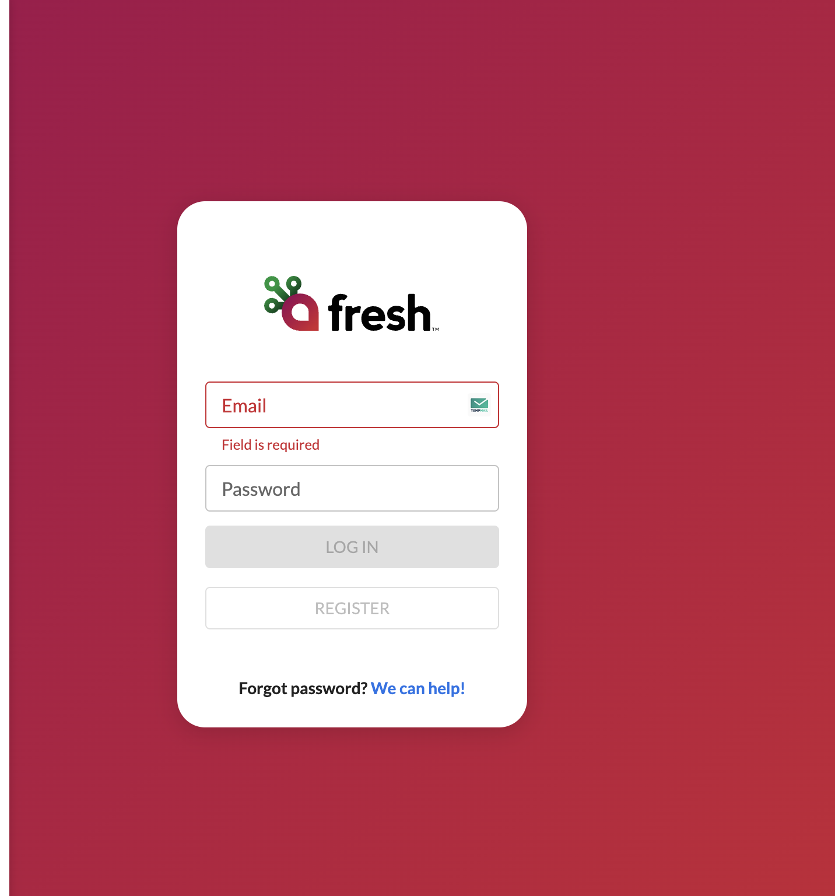

# Order Fresh

Cliente en Python para integrar **Fresh KDS** (Kitchen Display System). Usa el wrapper local `pyKDSAPI` y un conjunto de plantillas de orden (`order_templates.py`), y se puede operar de **dos formas**:

- **CLI** — menú interactivo en consola (`main.py`).
- **Web** — interfaz gráfica en el navegador con Flask (`app.py`).

Ambas versiones comparten el mismo wrapper, las mismas plantillas y la misma configuración en `.env`, así que solo necesitas hacer el setup una vez.

---

## 1. Requisitos

- **Python 3.9 o superior**.
- Un **token de integración** válido de Fresh KDS.
- (Opcional) `location` y `device` por defecto. Si no los pones, el CLI te deja elegirlos la primera vez y los guarda; en la web los eliges desde la barra superior.

## 2. Instalación

Desde la raíz del proyecto, crea un entorno virtual e instala las dependencias (`requests` y `flask`):

```bash
python3 -m venv .venv
source .venv/bin/activate        # en Windows: .venv\Scripts\activate
pip install -r requirements.txt
```

> A partir de aquí, mientras el entorno esté activado puedes usar `python` y `pip` directamente. Si prefieres no activarlo, antepone la ruta: `.venv/bin/python app.py`.

## 3. Obtener tu API Key de Fresh KDS

Antes de configurar el cliente necesitas un **token de integración** (también llamado API Key o `X-Integration-Token`). Sigue estos pasos:

### 3.1. Crear / iniciar sesión

Ve a **[https://app.freshtechnology.com/login](https://app.freshtechnology.com/login)** y crea una cuenta o inicia sesión si ya tienes una.



### 3.2. Generar y copiar el token

Una vez dentro, entra a la sección de **Integrations / API Keys** y crea un token nuevo. Cópialo apenas se muestre — algunas pantallas solo te lo enseñan una vez.


> El token es sensible: cualquiera con acceso a él puede enviar órdenes a tus pantallas KDS. **No lo subas a Git** ni lo compartas en mensajes públicos. Si crees que se filtró, revócalo desde el panel y genera uno nuevo.

### 3.3. Cargarlo en la app

Tienes tres formas equivalentes de entregarle el token al cliente — todas terminan guardándolo en `.env` como `X_INTEGRATION_TOKEN`:

| Forma | Cuándo conviene |
| --- | --- |
| **Web** — abre `http://localhost:5001`, pega el token en la card **"API Key (X-Integration-Token)"** y dale Guardar. | Lo más rápido si ya tienes la web corriendo. La interfaz nunca devuelve el valor completo después de guardar; solo muestra `01qB…AnfL`. |
| **CLI** — corre `python main.py`. Si no encuentra token en `.env` te lo pide por consola y lo guarda. | Útil en setup desde cero. |
| **Manual** — edita el archivo `.env` directamente (ver siguiente sección). | Útil para CI/CD o despliegues automatizados. |

---

## 4. Configuración (`.env`)

La configuración se centraliza en un archivo `.env` en la raíz del proyecto (está ignorado por Git para no subir secretos). Créalo con tu token:

```env
# Token de integración (cualquiera de los dos nombres funciona; usa el mismo valor)
X_INTEGRATION_TOKEN=TU_TOKEN
FRESH_KDS_API_KEY=TU_TOKEN

# Opcionales: location y device por defecto
FRESH_KDS_LOCATION_ID=TU_LOCATION_ID
FRESH_KDS_DEVICE_ID=TU_DEVICE_ID
```

Variables:

| Variable | Requerida | Descripción |
| --- | --- | --- |
| `X_INTEGRATION_TOKEN` | Sí | Token de integración activo. |
| `FRESH_KDS_API_KEY` | Alias | Mismo token; sirve como alternativa al anterior. |
| `FRESH_KDS_LOCATION_ID` | No | Location por defecto. Si falta, se elige/guarda en el primer uso. |
| `FRESH_KDS_DEVICE_ID` | No | Device por defecto. Igual que el anterior. |

> Tanto el CLI como la web pueden **escribir** de vuelta en `.env` cuando seleccionas o cambias location/device.

---

## 5. Cómo ejecutarlo

### Opción A — Versión web (navegador)

```bash
python app.py
```

Luego abre **[http://localhost:5001](http://localhost:5001)**.

- El puerto **5000** suele estar ocupado en macOS por "AirPlay Receiver", por eso la app usa **5001** por defecto.
- Para cambiar el puerto: `PORT=8000 python app.py`.

La interfaz lee el token y los IDs desde `.env`, permite cambiar location/device desde la barra superior (y guardarlos), y cubre las mismas operaciones del CLI: enviar órdenes por plantilla, consultas (health, marca, locations, devices, órdenes activas), acciones sobre una orden (cancelar, update parcial/completa, cliente llegó, ETA), mensajes a pantalla y red local TCP/UDP. Las respuestas se muestran en la consola lateral.

### Opción B — Versión CLI (consola)

```bash
python main.py
```

Comportamiento:

1. Lee el token desde `.env`.
2. Usa `FRESH_KDS_LOCATION_ID` y `FRESH_KDS_DEVICE_ID` si ya existen.
3. Si faltan, consulta la API, te deja elegir location y device, y los guarda en `.env`.
4. Muestra un menú numerado donde eliges la acción a ejecutar.

Menú del CLI:

```
1.  Enviar orden: send_order_complete copy.py
2.  Enviar orden: send_order_complete.py
3.  Enviar orden: send_order_max_3.py
4.  Enviar orden: send_order_max_30.py
5.  Enviar orden: delivery con handoff + driver
6.  Enviar orden: curbside con vehiculo + pickupTime
7.  Enviar orden: rush order prioridad + prepTimeDuration
8.  Enviar orden: pickup futuro con tiempo de preparacion
9.  Enviar orden: mesa con cursos, asientos y covers
10. Enviar orden: orden con costos, fees y promoCodes
11. Enviar orden: orden enviada a todas las pantallas
12. Enviar orden: 2 ordenes con el mismo nombre
13. Health check API
14. Ver informacion completa de la marca
15. Ver locations
16. Ver devices de la location
17. Ver ordenes activas
18. Enviar mensaje a pantalla KDS
19. Cancelar orden
20. Actualizar orden parcial
21. Actualizar orden completa
22. Notificar que el cliente llego
23. Actualizar ETA del cliente
24. Descubrir pantallas en red local
25. Enviar orden local por TCP
26. Actualizar orden local completa
27. Actualizar orden local parcial
28. Cancelar orden local
0.  Salir
```

---

## 6. Estructura del proyecto

| Archivo / carpeta | Para qué sirve |
| --- | --- |
| `main.py` | Punto de entrada del **CLI** (menú interactivo). |
| `app.py` | Punto de entrada de la **web** (servidor Flask). |
| `env_config.py` | Carga/escritura de `.env` y obtención de token, location y device. |
| `order_templates.py` | Plantillas de orden y `ORDER_OPTIONS` (catálogo compartido CLI/web). |
| `pyKDSAPI/` | Wrapper local de la API (`utils.py`, `structs.py`). |
| `templates/index.html` | Interfaz de la versión web. |
| `requirements.txt` | Dependencias (`requests`, `flask`). |
| `run_1_location.py` | Script suelto: consulta locations del token. |
| `run_2_devices.py` | Script suelto: consulta devices de una location. |
| `send_order_*.py` | Scripts de ejemplo de envío de órdenes. |

> El launcher recomendado es `main.py` (CLI) o `app.py` (web). Los scripts `send_order_*` y `run_*` son ejemplos sueltos.

---

## 7. Referencia del wrapper `pyKDSAPI`

### Endpoints cloud implementados

Rutas implementadas en `pyKDSAPI.utils` según la documentación de Fresh KDS:

- `GET /health`
- `GET /integrators/kds-information`
- `GET /integrators/kds-information/locations`
- `GET /integrators/kds-information/locations/{locationId}/devices`
- `GET /integrators/kds-orders/active`
- `POST /integrators/kds-orders`
- `PUT /integrators/kds-orders`
- `PUT /integrators/kds-orders/partial`
- `PUT /integrators/kds-orders/cancel`
- `POST /integrators/kds-notifications/customer-arrived`
- `POST /integrators/kds-notifications/estimated-arrival-update`
- `POST /integrators/kds-notifications/send-message`

Headers usados por la integración: `x-integration-token`, `x-location-id`, `x-device-ids`, `Content-Type: application/json`.

### Funciones cloud

- `healthCheck(token)`: valida que la API responda con el token.
- `createOrder(token, location_id, device_id, order)`: crea una orden con un payload ya armado.
- `updateOrder(token, location_id, device_id, order)`: actualiza una orden reenviando el payload completo.
- `partialUpdateOrder(token, location_id, device_id, order_id, **changes)`: actualiza solo campos puntuales.
- `cancelOrder(token, location_id, device_id, order_id)`: cancela una orden activa.
- `customerArrivedNotification(token, location_id, device_id, order_id)`: marca llegada de cliente.
- `estimatedArrivalUpdate(token, location_id, device_id, order_id, minutes)`: actualiza ETA.
- `sendKdsMessage(token, location_id, device_id, message)`: muestra un mensaje en pantalla KDS.
- `build_order_payload(...)` y `build_partial_order_payload(...)`: ayudan a construir payloads válidos.

Ejemplo de update parcial:

```python
from pyKDSAPI.utils import partialUpdateOrder

response = partialUpdateOrder(
    token,
    location_id,
    device_id,
    "orden-123",
    name="Cliente actualizado",
    priority=True,
    itemsToRemove=["linea-2"],
)
print(response)
```

Para sandbox, pasa `environment="sandbox"` en cualquier función cloud:

```python
healthCheck(token, environment="sandbox")
```

### Red local TCP/UDP

Según la documentación local de Fresh KDS, las tablets emiten discovery UDP en el puerto `28000` y reciben órdenes TCP en el puerto `9104`. El wrapper agrega:

- `parseDiscoveryBroadcast(data)`: parsea un broadcast de 102 bytes a `application`, `version`, `ipAddress`, `identifier` y `name`.
- `discoverLocalDevices(timeout=5.0)`: escucha broadcasts y retorna pantallas encontradas.
- `sendLocalOrder(ip_address, order)`: envía `create-order` por TCP.
- `updateLocalOrder(ip_address, order)`: envía `update-order` por TCP.
- `partialUpdateLocalOrder(ip_address, order_id, **changes)`: envía `partial-update-order`.
- `cancelLocalOrder(ip_address, order_id)`: envía `cancel-order`.

Ejemplo local:

```python
from pyKDSAPI.utils import discoverLocalDevices, sendLocalOrder

devices = discoverLocalDevices(timeout=5)
screen = devices[0]
response = sendLocalOrder(screen["ipAddress"], order_payload)
print(response)
```

---

## 8. Solución de problemas

| Síntoma | Causa probable / solución |
| --- | --- |
| `No se encontro X_INTEGRATION_TOKEN ni FRESH_KDS_API_KEY` | Falta el token. Pégalo desde la card "API Key" en la web, o deja que `python main.py` te lo pida (paso 3). |
| La web no abre en `localhost:5000` | El puerto correcto es **5001** (5000 lo usa AirPlay en macOS). |
| El puerto 5001 está ocupado | Usa otro: `PORT=8000 python app.py`. |
| `ModuleNotFoundError: flask` / `requests` | Activa el venv y corre `pip install -r requirements.txt`. |
| Quiero cambiar location/device | CLI: borra esas líneas del `.env` y vuelve a correr. Web: cámbialas desde la barra superior. |
| La web muestra `POST /api/send-order 200` pero la orden no aparece en el KDS | Solo pasaba en versiones viejas: ahora el endpoint propaga `502 + detalle` cuando el API real rechaza la orden. Revisa la consola lateral: te dirá el campo exacto que falló (`deliveryService`, `costs`, etc.). |
| `422 deliveryService: Value is not a valid object or has invalid values.` | El schema oficial de `DeliveryService` no acepta el campo `driverPhone` que algunas plantillas mandaban. Las opciones 1 y 2 ya no incluyen `deliveryService`. Para órdenes delivery usa la opción 5. |

---

## 9. Documentación oficial de Fresh KDS

Si quieres entender los payloads, endpoints y reglas detrás del wrapper, estas son las fuentes oficiales:

- 📘 **[Mobile / Local Network Integration — API Introduction](https://fresh-technology.github.io/fresh.kds.docs.mobile-local-network-integration/docs/api/introduction/)** — punto de entrada con todos los endpoints HTTP que usa `pyKDSAPI`.
- 📍 [Locations & Screens](https://fresh-technology.github.io/fresh.kds.docs.mobile-local-network-integration/docs/api/locations_screens/) — cómo descubrir locations y devices.
- 🛠️ [Developer Guide de Fresh KDS](https://www.fresh.technology/kds/developer-guide) — guía general para integradores.

> El wrapper local `pyKDSAPI` apunta por defecto a `https://integrations-api.ftservices.cloud`. Para usar el ambiente de pruebas pasa `environment="sandbox"` a cualquier función cloud y se enrutará a `https://sandbox-integrations-api.ftservices.cloud`.

## Notas

- El proyecto silencia el warning de `urllib3` relacionado con LibreSSL para que no ensucie la salida.
- `.env` está ignorado por Git para no subir secretos.
